# FortiGate Firewall Lab Portfolio

Hands-on FortiGate firewall lab project covering initial deployment, security policies, NAT,
SSL-VPN remote access, and log-based monitoring. Built on a FortiGate VM (v7.0.5) as a
self-directed learning project.

**Author:** Ahmed Hussien Said Hossam Eldin
**Background:** CCNA Certified, CCNP ENCOR (in progress), Faculty of Engineering student
**Contact:** ahmed.hussien.hossam@gmail.com · [LinkedIn](https://www.linkedin.com/in/ahmed-hussien-689a133a8)

---

## 📋 Lab Overview

| # | Task | Skills Demonstrated |
|---|------|---------------------|
| 1 | [Initial Setup](#task-1--initial-fortigate-setup) | VM deployment, interface configuration, admin hardening |
| 2 | [Security Policies](#task-2--security-policies) | Least-privilege firewall rules, DNS-in-policy troubleshooting |
| 3 | [NAT](#task-3--nat-source--destination) | Source NAT, Destination NAT / Virtual IP, port forwarding |
| 4 | [SSL-VPN](#task-4--ssl-vpn-remote-access) | Remote access VPN, portal config, client setup, TLS troubleshooting |
| 5 | [Logging & Monitoring](#task-5--logging--monitoring) | Audit log analysis, event-level detail inspection |

---

## Task 1 — Initial FortiGate Setup

Deployed a FortiGate VM and performed initial hardening: changed the default admin password,
set the hostname, and configured the LAN (`port2`) and WAN (`port1`) interfaces with static IPs
and administrative access controls (PING/HTTPS/SSH).

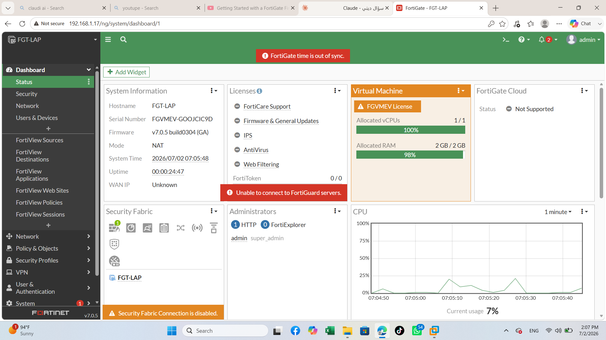
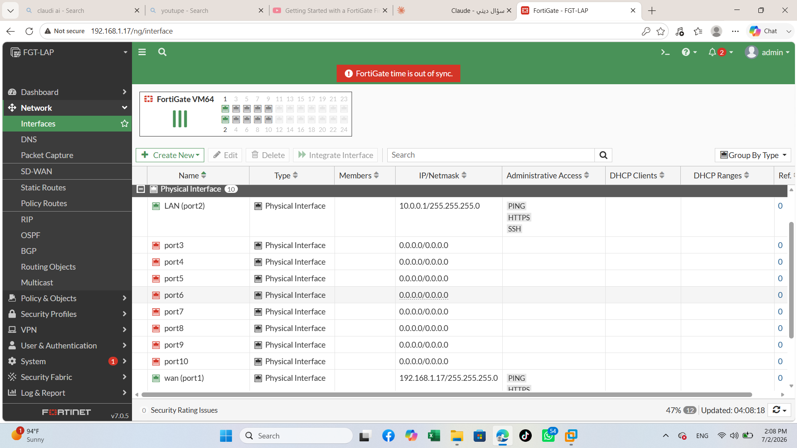

---

## Task 2 — Security Policies

Built a LAN→WAN firewall policy restricted to **HTTP, HTTPS, and DNS only** (least privilege).

**Troubleshooting note:** Initial testing failed even though the policy looked correct. Root cause:
DNS traffic (port 53) wasn't in the allowed services list, so the browser couldn't resolve domain
names before making the HTTP/HTTPS request. Adding DNS to the policy resolved it — confirmed with
live Forward Traffic logs.

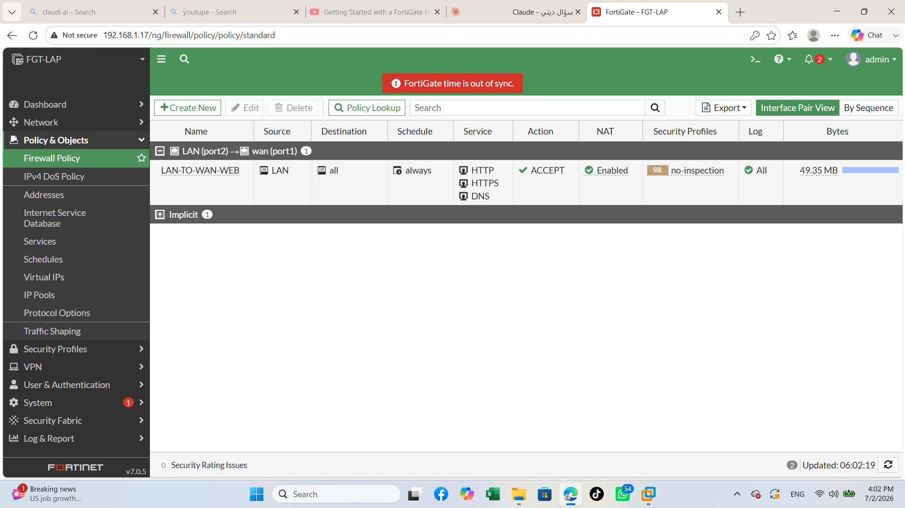
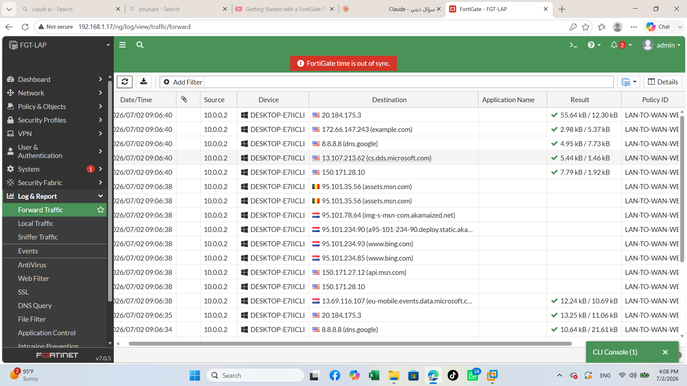

---

## Task 3 — NAT (Source & Destination)

- **Source NAT:** Outbound LAN traffic translated via the WAN interface address (standard internet access for internal hosts).
- **Destination NAT / Virtual IP:** Exposed an internal Python HTTP server (`10.0.0.2:8080`) to the WAN
  side via a Static NAT + Port Forwarding Virtual IP, simulating publishing an internal service externally.

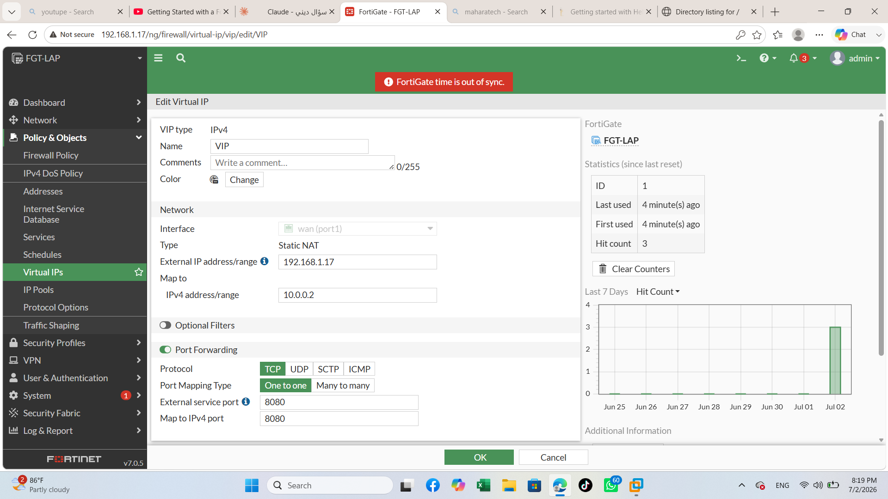
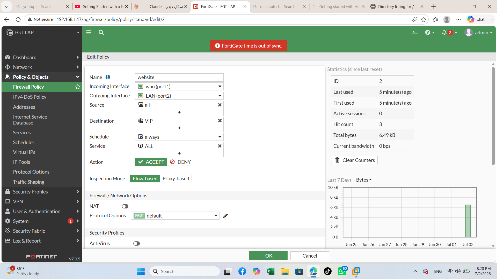
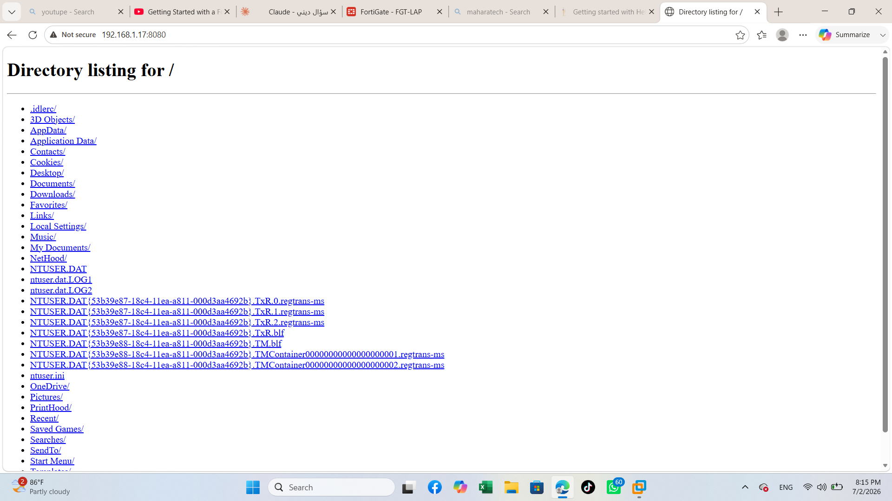

---

## Task 4 — SSL-VPN (Remote Access)

Configured a complete SSL-VPN remote access solution:
- Local user + user group dedicated to VPN access
- SSL-VPN portal in **Full Tunnel mode** (split tunneling disabled) with a dedicated IP pool
- Server certificate binding and custom listening port
- Firewall policy scoping VPN client traffic to the internal LAN, tied to the specific user group
- Client-side setup and connection testing via **FortiClient VPN**

**Troubleshooting note:** Hit a real `ERR_SSL_VERSION_OR_CIPHER_MISMATCH` error during client
connection testing. Used FortiGate CLI-level debugging (`diagnose debug application sslvpn -1`)
to trace it to certificate/cipher negotiation on the FortiGate VM — a good example of
protocol-level troubleshooting beyond just GUI configuration.

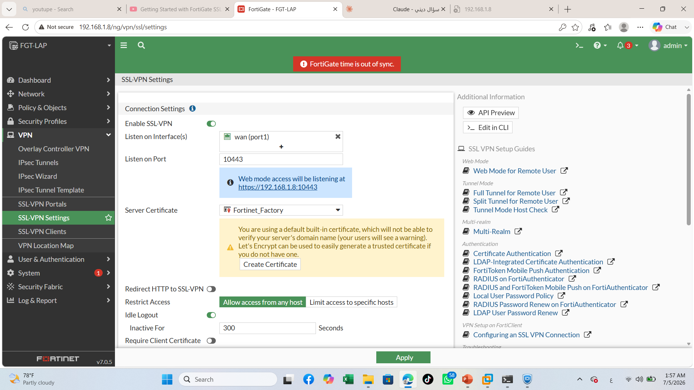
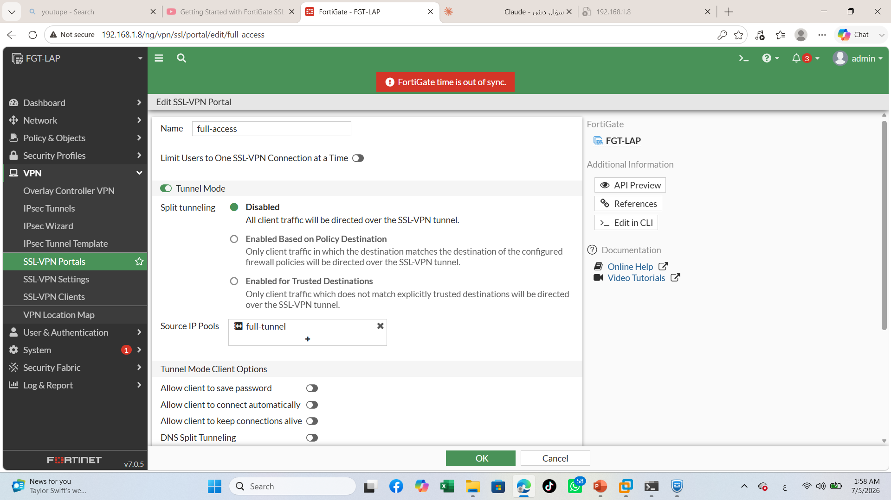
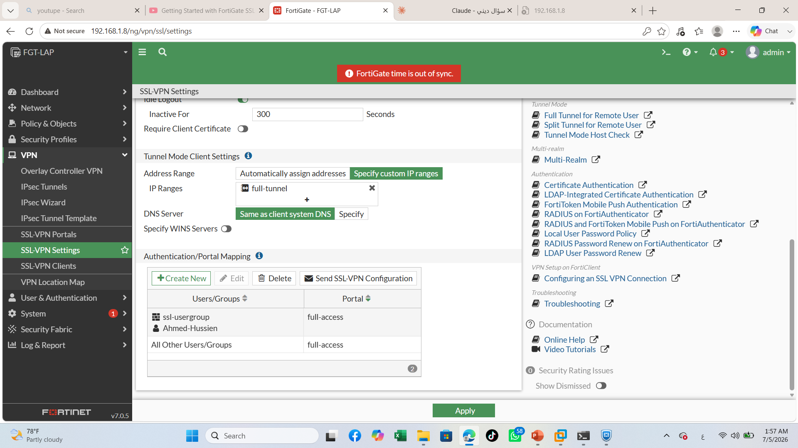
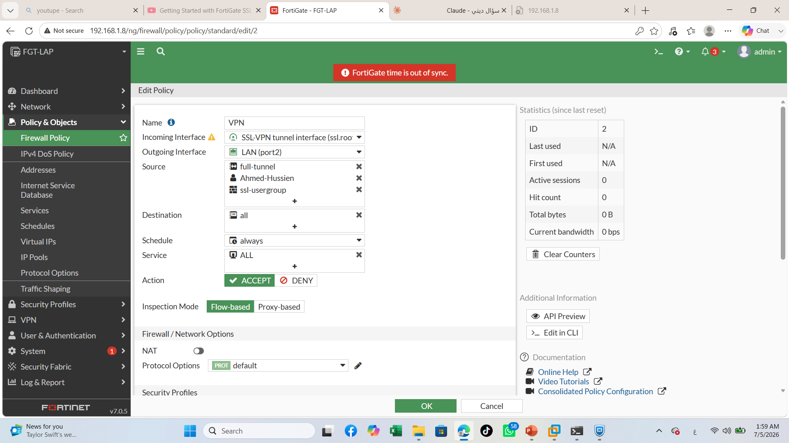
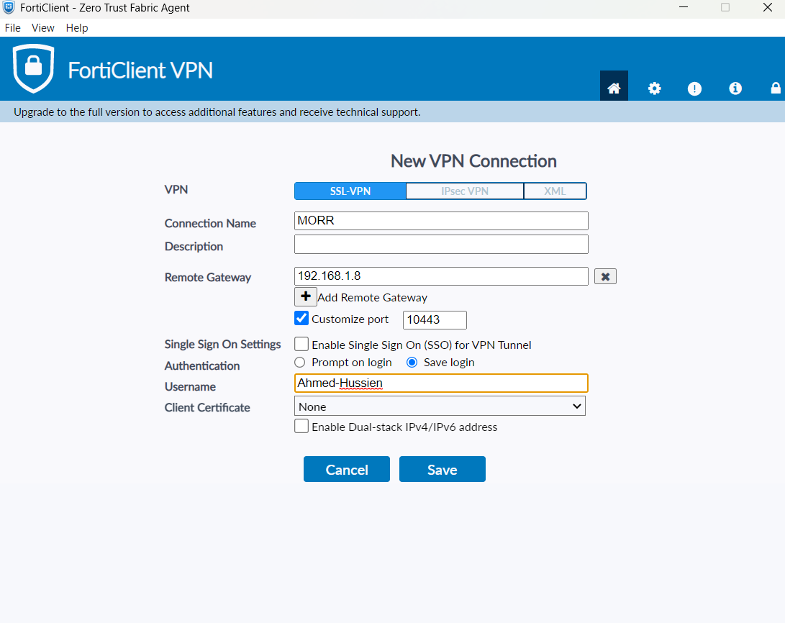

---

## Task 5 — Logging & Monitoring

Reviewed the **System Events log** as a full audit trail of every configuration change made during
the lab (user creation, policy edits, VPN settings) — each timestamped and tied to the admin account
and source IP. Drilled into a single event's **Log Details** panel to read structured fields
(config path, transaction ID, action type) rather than just the summary line.

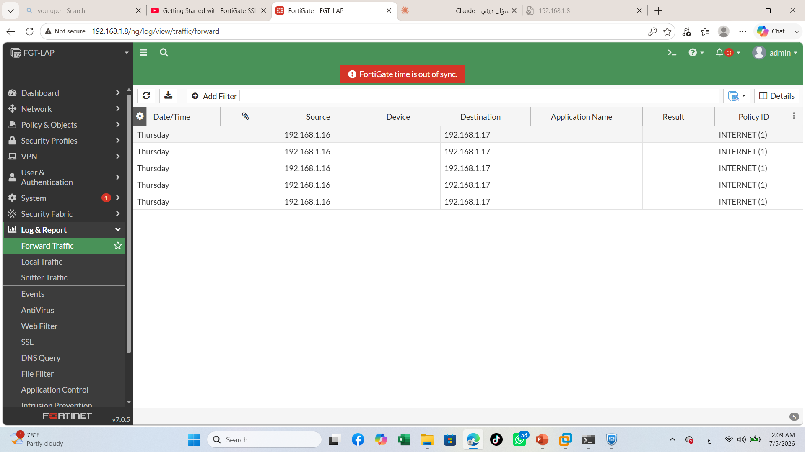
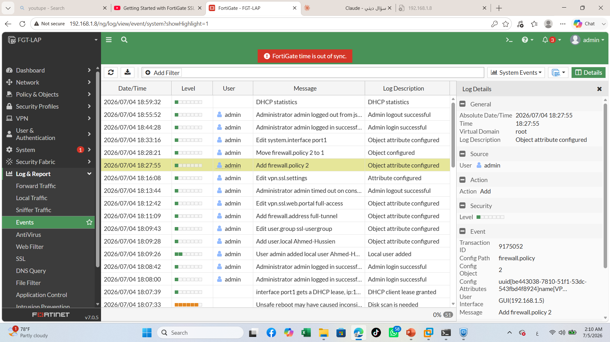

---

## 🛠️ Environment

- **Platform:** FortiGate VM, firmware v7.0.5
- **Tools:** FortiGate GUI & CLI, FortiClient VPN, Python `http.server` (test web service)
- **Skills covered:** Firewall policies, NAT/PAT, Virtual IPs, SSL-VPN, TLS troubleshooting, system logging & auditing

## 📄 Full write-up

See the companion PDF report ([`FortiGate_Lab_Portfolio.pdf`](./FortiGate_Lab_Portfolio.pdf)) for
a single-document version of this portfolio with task summaries and screenshots combined.
